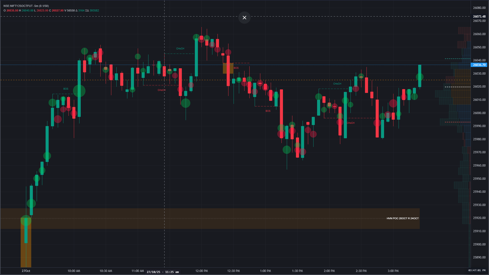
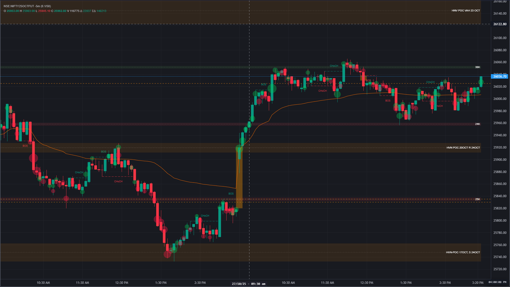
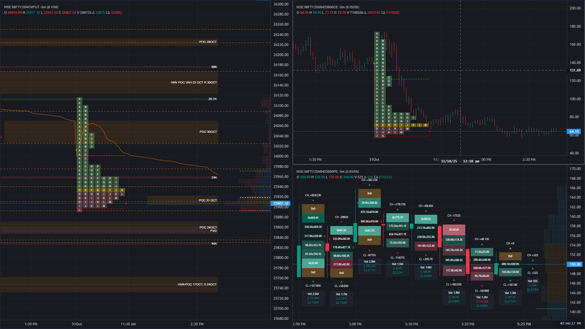
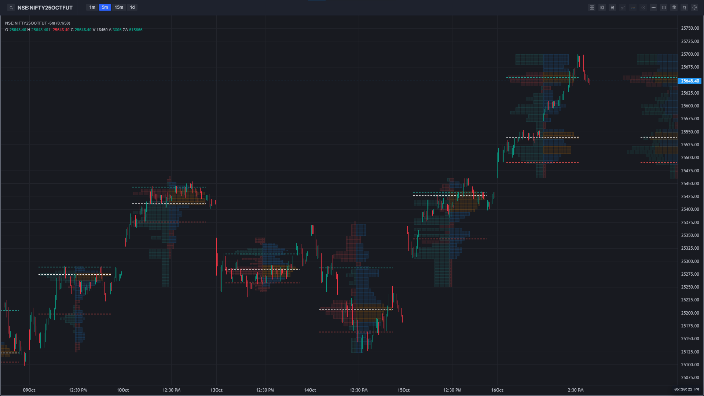
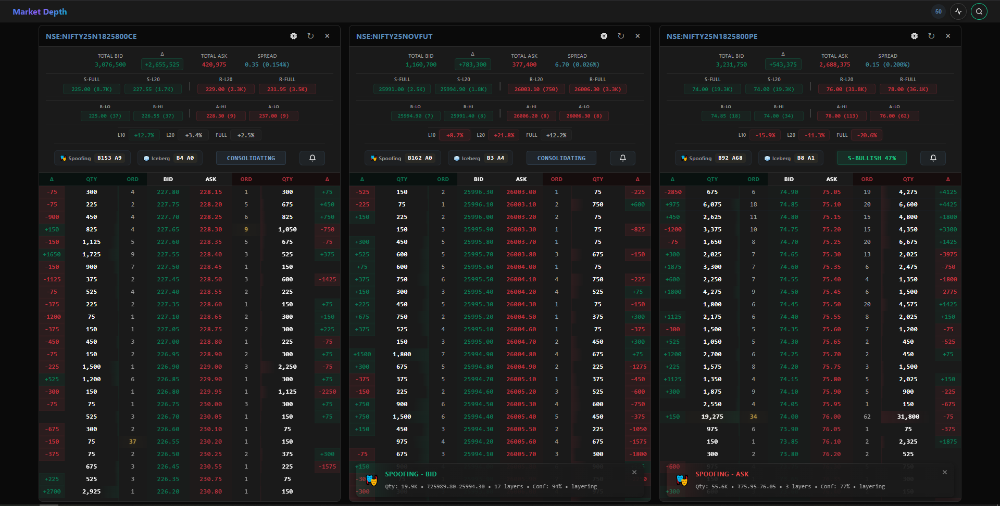
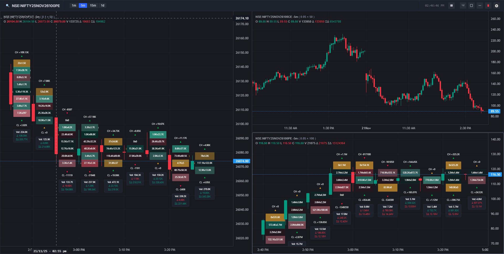

# Chartink- Oderflow Charts 

A web-based trading chart platform integrated with Fyers API for real-time market data, technical analysis, and interactive charting capabilities.

## Features

- **Real-time Market Data**: Integration with Fyers API for live market data and historical price information
- **Interactive Charts**: Advanced charting tools with drawing capabilities, multiple timeframes
- **WebSocket Integration**: Real-time data streaming using Socket.IO
- **Authentication System**: Secure OAuth integration with Fyers API
- **Responsive Design**: Modern, mobile-friendly interface
- **Search & Watchlist**: Stock search functionality and customizable watchlists
- **Timezone Support**: Automatic timezone detection and conversion
- **Settings Panel**: User-configurable chart preferences and display settings

## Tech Stack

- **Backend**: Flask (Python web framework)
- **Real-time Communication**: Socket.IO
- **API Integration**: Fyers API v3
- **Data Processing**: Polars for high-performance data manipulation
- **Database**: SQLAlchemy ORM support
- **Frontend**: HTML5, CSS3, JavaScript with Lightweight Charts library

## Project Structure

```
tradelab_fpc/
├── app/                    # Flask application modules
│   ├── __init__.py        # App initialization
│   ├── routes.py          # Main application routes
│   └── socket_events.py   # WebSocket event handlers
├── core/                  # Core business logic
│   └── fyers/            # Fyers API integration
│       ├── auth.py       # Authentication handling
│       ├── fyers_data.py # Data fetching utilities
│       └── processor.py  # Data processing logic
├── static/               # Static assets
│   ├── css/             # Stylesheets
│   └── js/              # JavaScript modules
├── templates/           # HTML templates
├── ticker/             # Additional ticker utilities
├── config.py           # Configuration management
├── main.py            # Application entry point
├── requirements.txt   # Python dependencies
├── .env.example      # Environment variables template
└── README.md         # This file
```

## Installation

### Prerequisites

- Python 3.12 or higher
- Fyers API credentials (Client ID and Secret Key)

### Setup

1. **Clone the repository**
   ```bash
   git clone https://github.com/kodebuds/chartink
   ```

2. **Create a virtual environment**
   ```bash
   python -m venv venv

3. **Install dependencies**
   ```bash
   pip install -r requirements.txt
   ```

4. **Set up environment variables**
   ```bash
   # Copy the example environment file
   cp .env.example .env

   # Edit .env with your configuration
   # Required variables:
   # - SECRET_KEY: Flask secret key for session management
   # - FYERS_CLIENT_ID: Your Fyers API client ID
   # - FYERS_SECRET_KEY: Your Fyers API secret key
   # - FYERS_REDIRECT_URI: Callback URL for Fyers OAuth
   ```

5. **Initialize the database (if using SQLAlchemy features)**
   ```bash
   # This step may be required based on your database setup
   # Check the application for database initialization commands
   ```

## Configuration

The application supports multiple environments through environment-specific configuration files:

- **Development**: `.env.development` (or set `FLASK_ENV=development`)
- **Production**: `.env.production` (or set `FLASK_ENV=production`)
- **Testing**: `.env.testing` (or set `FLASK_ENV=testing`)

### Environment Variables

| Variable | Description | Default |
|----------|-------------|---------|
| `FLASK_ENV` | Environment mode | `development` |
| `SECRET_KEY` | Flask secret key | `dev-key-change-in-production` |
| `APP_HOST` | Application host | `0.0.0.0` |
| `APP_PORT` | Application port | `5000` |
| `SOCKETIO_ASYNC_MODE` | Socket.IO async mode | `threading` |
| `CORS_ORIGINS` | Allowed CORS origins | `*` |
| `FYERS_CLIENT_ID` | Fyers API client ID | Required |
| `FYERS_SECRET_KEY` | Fyers API secret key | Required |
| `FYERS_REDIRECT_URI` | Fyers OAuth callback URL | Required |
| `LOG_LEVEL` | Logging level | `INFO` |

## Running the Application

### Development Mode

```bash
python main.py
```

The application will be available at `http://localhost:5000`

## Usage

### First-Time Setup

1. Navigate to the application URL
2. Click on the Fyers authentication link
3. Complete the OAuth flow with your Fyers credentials
4. Once authenticated, you can access market data and charting features

### Main Features

#### Main layout



- **Search Stocks**: Use the search bar to find stocks by symbol or name
- **View Charts**: Select a stock to view interactive price charts
- **Technical Analysis**: Apply various technical indicators and drawing tools
- **Real-time Updates**: Charts update automatically with live market data
- **Customize Settings**: Adjust chart preferences, timeframes, and display options

#### With Indicator



- **Advanced Filtering**: Filter stocks based on technical indicators, price movements, volume patterns
- **Custom Criteria**: Create and save your own screening formulas
- **Real-time Results**: Get updated screener results based on current market data

#### Multi Chart Layout


#### OderFlow


#### Volume Profile 


#### Depth Of Market


### Lightweight version: only includes the base order flow chart so you can build anything on top of it like above



## API Integration

The application integrates with the Fyers API for:

- **Authentication**: OAuth 2.0 flow for secure access
- **Market Data**: Real-time and historical price data
- **Watchlist Management**: Create and manage stock watchlists
### Required Fyers API Permissions

Ensure your Fyers API app has the necessary permissions for:
- Market data access
- Historical data fetching

## Development

### Adding New Features

1. **Backend Changes**: Add routes in `app/routes.py` or create new modules in `app/`
2. **Frontend Changes**: Modify templates in `templates/` and JavaScript in `static/js/`
3. **API Integration**: Extend Fyers integration in `core/fyers/`
4. **Configuration**: Update `config.py` for new environment variables

### Developer Documentation

For detailed technical documentation on data formats, footprint chart implementation, and backend processing requirements, please refer to:

**[📖 Developer Documentation](developer.md)**

The developer documentation includes:
- Detailed data format specifications for footprint charts
- Backend processing pipeline documentation
- API endpoint specifications
- WebSocket message formats
- Configuration parameters and bucket size calculations
- Performance optimization guidelines
- Debugging and troubleshooting information

**⚠️ Important**: The developer documentation contains educational content and implementation examples. Always refer to the disclaimer section for usage guidelines.

### Logging

The application supports configurable logging:

- Development: Detailed debug logs
- Production: Error and warning logs
- Custom log levels can be set via `LOG_LEVEL` environment variable

## Troubleshooting

### Common Issues

1. **Authentication Failures**
   - Verify Fyers API credentials are correct
   - Check redirect URI matches your Fyers app configuration
   - Ensure your Fyers app has the required permissions

2. **Connection Issues**
   - Check if required ports are open
   - Verify CORS settings for your deployment environment
   - Ensure WebSocket connections are not blocked by firewalls

3. **Data Not Loading**
   - Verify Fyers API rate limits
   - Check network connectivity
   - Review application logs for error messages

### Debug Mode

Enable debug mode for detailed error information:

```bash
export FLASK_ENV=development
export DEBUG=True
python main.py
```

## Contributing

1. Fork the repository
2. Create a feature branch
3. Make your changes
4. Add tests if applicable
5. Submit a pull request

## Security Considerations

- Never commit sensitive information like API keys or secrets
- Use environment variables for configuration
- Implement proper rate limiting for API calls
- Validate and sanitize all user inputs
- Use HTTPS in production environments

## License

This project is licensed under the MIT License - see the LICENSE file for details.

## Support

For support and questions:

1. Check the troubleshooting section above
2. Review the application logs for error messages
3. Consult the Fyers API documentation
4. Create an issue in the project repository

## Stock Market Disclaimer

**⚠️ IMPORTANT DISCLAIMER**: This application is for educational and informational purposes only. Trading in financial markets involves substantial risk of loss and is not suitable for all investors. Past performance is not indicative of future results.

- Always do your own research before making any investment decisions
- Never trade with money you cannot afford to lose
- This software does not provide financial advice
- Consult with a qualified financial advisor before making investment decisions
- The developers are not responsible for any trading losses incurred  

## Portfolio Project Notice

**This application is developed as a portfolio project to demonstrate development skills and capabilities for employment purposes.**

This project showcases my abilities in:
- Full-stack web development (Python backend, JavaScript frontend)
- Real-time data processing and WebSocket implementation
- Financial data visualization and chart rendering
- API development and system architecture
- Database integration and performance optimization

**Not for Trading:** While this application demonstrates technical concepts related to financial data processing, it is not intended for actual trading or investment decisions. The implementation is for educational and portfolio demonstration purposes only.

## Acknowledgments

Special thanks to:

- **[TradingView](https://www.tradingview.com/)** - For the excellent Lightweight Charts library that powers our interactive charts
- **[Fyers API](https://fyers.in/)** - For providing reliable market data and trading API services

---

Made with ❤️ by **>Kodebuds Research and Development**

Email :  kodebuds@gmail.com | Join Discord :  https://discord.gg/yZ67gDD2

Happy ------>koding!

